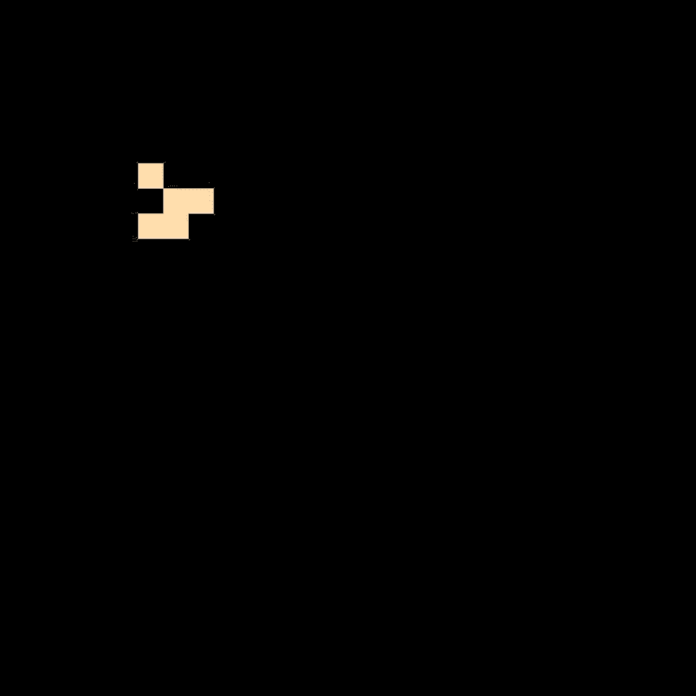
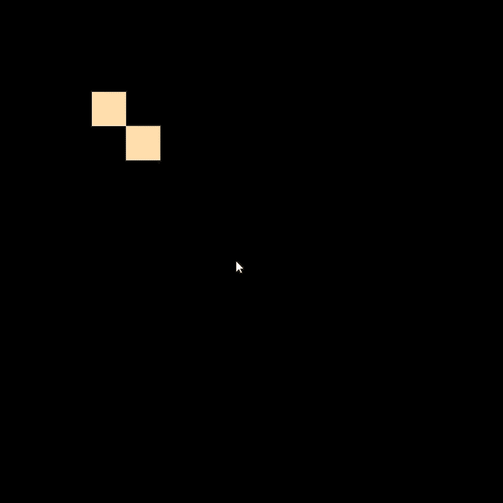

<h1 align="center">Conway Game of Life</h1>
<h4 align="center">Made with Pygame and Numpy</h4>


## Introduction to Conway Game of Life
The *Game of Life*, also known simple as Life, is a cellular automaton dvised by the British mathematician John Horton Conway in 1970. With it's rules as follow:


* Any live cell with two or three live neighbours survives.
* Any dead cell with three live neighbours becomes a live cell.
* All other live cells die in the next generation. Similarly, all other dead cells stay dead.


## Installation

1. Clone the repo
   ```sh
   git clone https://github.com/Cody-Le/Conway-Game-Of-Life.git
   ```
2. Edit any Variable to your liking
   ```sh
   height, width = [30,30]
   underPopRate = 2
   highPopRate = 3
   minimumSpawnRate = 3
   ```


2. Run main.py
   ```sh
   py main.py


## Demo of the program
<p align"center">



</p>
<h3>The glider, beacon and a chaotic system within the simulation</h3>
